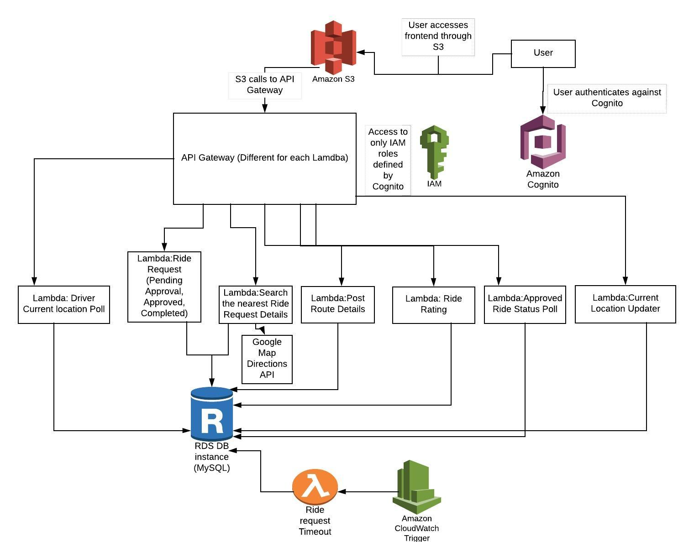

# AWS-Cloud-RideShare-App
A carpooling service, where people can share rides with other people travelling on the same route
## Synopsis
**Project Idea:** 
1. A carpooling service, where people can share rides with other people travelling on the same route. Thus reducing the traffic on road. 
2. Our aim was to create a mobile app using AWS cloud services stack and Google Maps API that allows users to securely coordinate small transfers in the city. The app is able to accommodate requests from users travelling on the same route and is also able to make small deviations according to user’s comfort.

**Architecture Diagram:** 

**Additional API Used:** 
1. Google Geocoding API: Used to map physical address to latitude and longitude on the map
2. Google Maps Driving Direction API: Calculates directions between locations

## More
[Project Report](RideShare_App_Report.pdf) 
[RideShare App Download Link](https://s3.amazonaws.com/gonativeio/static/5c1a2c266825df7936220f1f/app-release.apk) 
[Demo](https://youtu.be/NN6HuxzuozU) 
